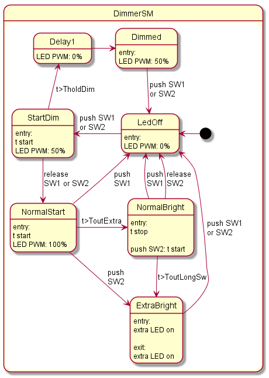

# TouchDimmer2
Touch dimmer with 2 touch sensor and 2 LED on Arduino   
(*A small demo of using and documenting of state machine*)

## State machine
I like to use state machine even for small project. I made a simple [FSM framework](statemachine.c) with function pointers. Each state has an event handler function. Entry/exit actions implemented as special events. They will be called automatic at state transition. The state machine in graphical form (state diagram) is excellent readable but not in source code format. You must draw the diagrams parallel with the coding of SM if you want to keep them in sync. Or...   
There is a great tool to visualise the state machine: [PlantUML](http://plantuml.com/en/state-diagram). The advantage of this tool: we can draw UML diagrams, using a simple and human readable text description. I use it direct in the C/C\+\+ source code as a special form of comment (like Doxygen metadata). We do not have to maintain the state diagram in a separate file/project/paper, but in the [source code of state machine](sm_dimmer.c). You need only a little effort to mark down the state diagram if you maintain the state diagram immediately with the changes of C/C++ source. The PlantUML commands are after `//u `prefix. A [simple AWK script](uml.awk) can extract this metadata into .uml file.

## Build
I prefer to use my well-tried IDE instead of Arduino IDE. The source is set up to use makefile build. We need the [Arduino Makefile](https://github.com/sudar/Arduino-Makefile). For ATtiny MCUs we need to install [ATTinyCore](https://github.com/SpenceKonde/ATTinyCore) or similar.

Compiling:

    make
Generate state diagram image:

    make uml

TODO
